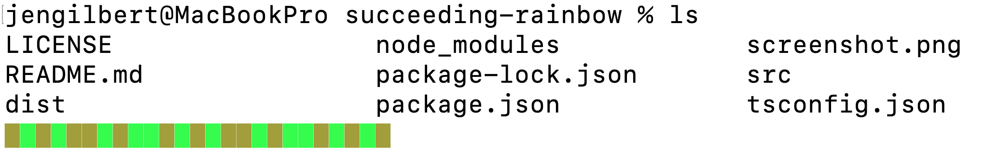
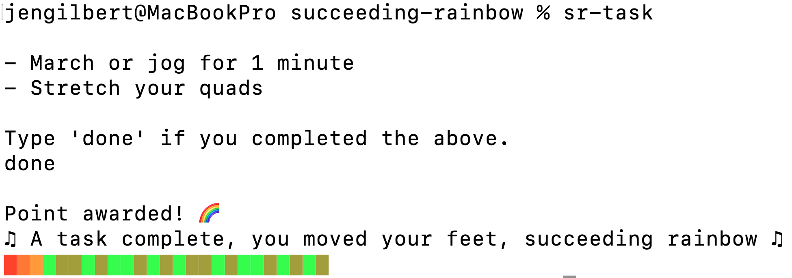

# Succeeding Rainbow

♫ A task complete, you moved your feet, succeeding rainbow ♫

Succeeding Rainbow (SR) is a script that cheers you on from the command line, encouraging you to move your body and stay healthy.

After every command you run in terminal, you will see a hideous swamp snake:



Your goal is to complete enough tasks to magically turn this swamp snake into a rainbow.

Run `sr-task` on the command line to receive your next assignment, and type `done` once you complete it. One segment of the swamp snake will become a rainbow:



The swamp snake will hibernate for 30 minutes, leaving you to do your work in peace without any unsettling glimpses of its ghastly countenance. In the meantime, you're still welcome to run `sr-task` ... and you probably should, because the beast is 25 segments long.

Failed in your quest to defeat the snake of sloth? Don't worry, tomorrow is a new day!

## Setup

### Install the package

1. Clone the repo.
2. From inside the repo, run `npm install && npm run build`.
3. Run `npm link` to install the `sr-*` commands on your machine.

### Display the progress banner after each terminal command

Add this to your `~/.zshrc` file:

```shell
function precmd() {
    sr-reminder
}
```

Reload your shell for the changes to take effect:

```shell
source ~/.zshrc
```

### Complete a task

To request a task, run `sr-task`. You'll get a fitness task and a stretching task. Once you've completed them, type `done`, and you'll be rewarded with a new color block in your progress banner.

If you don't like the tasks, you can always change them in `src/task.ts`, then re-run `npm run build`.

Complete the full 25-item banner, and you'll get a trophy!
