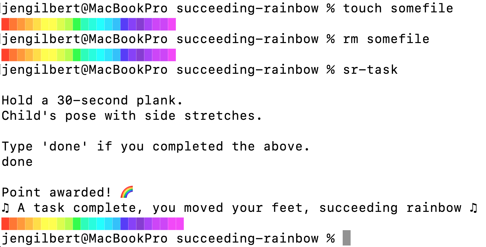

# Succeeding Rainbow

♫ A task complete, you moved your feet, succeeding rainbow ♫

Succeeding Rainbow (SR) is a script that cheers you on from the command line, encouraging you to move your body and stay healthy.

SR can be configured to print your progress banner every time you run a command in your terminal. When you want to add to your progress banner, you can ask SR for a fitness task to complete.



## Setup

### Install the package

1. Clone the repo.
2. From inside the repo, run `npm install && npm run build`.
3. Run `npm link` to install the `sr-*` commands on your machine.

### Display the progress banner after each terminal command

Add this to your `~/.zshrc` file:

```shell
function precmd() {
    sr-reminder
}
```

Reload your shell for the changes to take effect:

```shell
source ~/.zshrc
```

Your progress banner defaults to "😩", since you have made no progress. Sad.

### Complete a task

To request a task, run `sr-task`. You'll get a fitness task and a stretching task. Once you've completed them, type `done`, and you'll be rewarded with a new color block in your progress banner.

If you don't like the tasks or the length of the banner, you can always change them, then re-run the installation commands above.

Complete the full 25-item banner, and you'll get a trophy!
